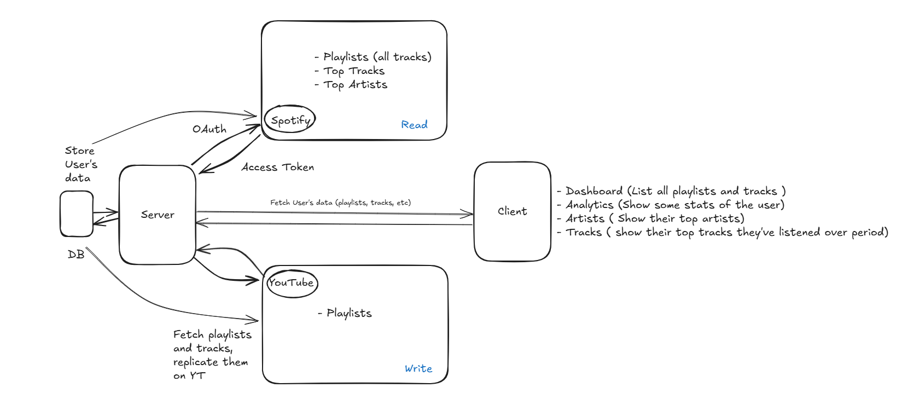

# Tune Bridge

Effortlessly transfer your playlists from Spotify to YouTube Music, with personalized listening insights coming soon.

## ✨ Features

* Seamless authentication with Spotify and Google (for YouTube).
* Browse and select your Spotify playlists for transfer.
* Accurately match and create playlists in your YouTube account.
* Handles various playlist sizes.
* Securely connects using OAuth 2.0.
* *(If implemented)* Dashboard for personalized listening activity charts (e.g., Top Tracks, Artists, Genres, Listening Time).
* *(Mention any other specific features, e.g., handling duplicates, progress indication during transfer).*
<!-- 
---

<!-- ## 🚀 Live Demo

Experience it live! [Link to your deployed application]

*(**Recruiter Tip:** A live demo is CRUCIAL. Make this link prominent).*
*(Consider adding a GIF or screenshots here as well for a quick visual showcase).*

 --> 

---

## 💡 Problem Solved

Manually recreating playlists across different music streaming services is a tedious and time-consuming process. This application eliminates that frustration by providing a direct, automated way to migrate curated music collections from Spotify to YouTube Music.

---

## ⚙️ Technologies Used

* **Frontend:** Next Js
    * Styling: [Tailwind CSS]
    * UI Components: [Shadcn UI, Aceternity UI, Motion Primitives]
    * State Management: [React Context]
* **Backend (if applicable):** Next.js (API Routes), Node.js/Express,
    * API Interaction: [ Axios]
    * Authentication: [Clerk]
* **Database:** [Prisma (ORM), PostgreSQL]
* **Deployment:** [Vercel]
* **APIs:** Spotify Web API, YouTube Data API (v3)

---

## 🧠 How It Works (High-Level Overview)

1.  **Authentication:** Users securely connect their Spotify and Google accounts via OAuth 2.0, granting specific permissions (read Spotify playlists, manage YouTube playlists).
2.  **Data Fetching:** The application fetches the user's selected playlists and track details from the Spotify Web API.
3.  **Matching:** Tracks are searched for and matched against the YouTube Music catalog using the YouTube Data API.
4.  **Transfer & Saving:** New playlists are created in the user's YouTube account, and the matched songs are added. Relevant user and playlist data are stored in the database ([Your Database, e.g., PostgreSQL via Prisma]).
<!-- 5.  **(If applicable)** **Data Analysis:** Stored listening data is processed to generate personalized charts and insights displayed on the user dashboard. -->
- High Level Architecture

---

## 🚧 Future Enhancements / Roadmap

* Implement the full personalized listening activity dashboard.
* Add support for transferring Liked Songs, Albums, and Artists.
* Improve song matching accuracy.
* Allow users to manage or delete imported playlists within the app.
* Add options for handling transfer errors or missing tracks.
* Optimize performance for very large playlists.

---

## 💻 Installation and Setup (Optional but Recommended)

*(Only include if you want others to be able to run it locally. This is good practice for open-source projects).*

1.  Clone the repository: `git clone [Your Repo URL]`
2.  Navigate to the project directory: `cd [Your Project Folder]`
3.  Install dependencies: `npm install` (or `yarn install`, `pnpm install`)
4.  Set up environment variables: Create a `.env` file based on `.env.example`. You will need to obtain API credentials from:
    * Spotify Developer Dashboard
    * Google Cloud Console (for YouTube Data API)
    * Database connection URL ([Your Database setup])
5.  Run database migrations (if using Prisma): `npx prisma migrate dev`
6.  Start the development server: `npm run dev` (or equivalent)

*(**Recruiter Tip:** Demonstrates you can set up a development environment and structure a project for collaboration).*

---

## Lessons Learned & Challenges Faced

* **Authentication Complexity:** Implementing the OAuth 2.0 flow for two different major platforms (Spotify and Google) presented unique challenges in managing redirects, tokens, and secure credential handling. Learned a lot about secure API authorization patterns.
* **API Rate Limits & Quotas:** Discovering and working within the rate limits of external APIs required implementing error handling, retries, and potentially queuing mechanisms to ensure reliable data fetching for large requests (like big playlists).
* **Data Mapping & Matching:** Matching songs accurately between two different catalogs based on potentially varied metadata (title, artist, album) involved designing robust search and matching logic. Learned the importance of fuzzy matching or leveraging platform-specific IDs where possible.
* **Asynchronous Operations:** Handling multiple asynchronous API calls (fetching user, then playlists, then tracks for each playlist, then searching on YouTube, then saving to DB) required careful use of Promises, async/await, and potentially optimizing concurrent operations.
* **Database Schema Design:** Designing a database schema ([mention DB/ORM]) to efficiently store user information, playlists, and track details while considering future features (like activity tracking) required thoughtful planning.

---

## ✍️ Author

Manjunath Irukulla 
[LinkedIn](https://www.linkedin.com/in/irumanjunath/])
[GitHub](https://github.com/yoursmanjunad) 
[Portfolio Website](https://www.manjunath.live/)
Email: imanjunad@gmail.com

---

## 📄 License

This project is licensed under the MIT License - see the LICENSE.md file for details. *(Most portfolio projects use MIT).*

---